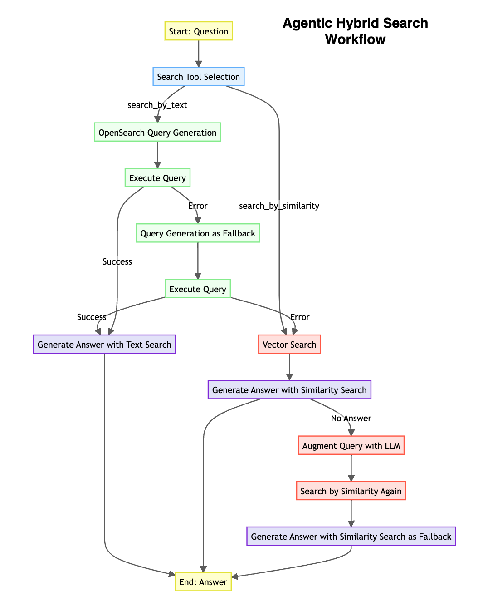

# RAG Chatbot with OpenSearch

This project demonstrates a new approach to information retrieval and analysis, enhancing  RAG methods with the power of OpenSearch.

While typical RAG approaches solely rely on contextual similarity to locate desired information, they often fall short when analyzing document-wide trends or performing aggregation tasks. Even ensemble-based hybrid search methods, which combine multiple retrieval techniques, struggle to provide comprehensive aggregation information across the entire knowledge base.

For instance, without creating separate summaries based on anticipated user questions, typical RAG systems would struggle to accurately answer a simple query like "How many sessions are there in reinvent 2024?"

This solution addresses these limitations by leveraging OpenSearch for efficient information storage and retrieval.

## Project Structure
```
├── 1.preprocess.ipynb
├── 2.load_to_opensearch.ipynb
├── 3.rag_with_opensearch.ipynb
├── chatbot-with-opensearch.py
├── libs
│   ├── __pycache__
│   │   └── workflow.cpython-39.pyc
│   └── workflow.py
├── prompts.yaml
├── reinvent.txt
├── session_info_with_emb.json
└── sessions_info.json
```

## File Descriptions

### 1.preprocess.ipynb
This notebook converts the example file (reinvent.txt) into a JSON format suitable for OpenSearch. Based on the given session names and synopses, it generates fields such as topic, target_audience, and aws_service. To create JSON documents in the correct format, it uses the tool_use (function_calling) method supported by Bedrock and Claude models. Upon completion of this notebook, a structured session_info.json file is generated from reinvent.txt.

### 2.load_to_opensearch.ipynb
This notebook creates an index in OpenSearch that matches the given JSON file, and collects some fields as embeddings into the index. For this task, you need to create an OpenSearch cluster in advance and set up the connection information in a .env file. 

The .env file should follow this format:
```
OPENSEARCH_HOST=https://....es.amazonaws.com 
OPENSEARCH_USER={username} 
OPENSEARCH_PASSWORD={password} 
OPENSEARCH_REGION={region_name} 
OPENSEARCH_INDEX={index_name}
```

If you create an OpenSearch cluster in VPC mode, modify the connection attempt to use AWS Auth instead of user and password.

### 3.rag_with_opensearch.ipynb
This notebook constructs an information exploration workflow. In this workflow, it selects the appropriate search method based on the type of user question, performs the search, and generates answers using the context obtained. To increase the reliability of the task, it provides a fallback strategy.



### chatbot-with-opensearch.py
This file implements the workflow from 3.rag_with_opensearch.ipynb in the form of a chatbot. The chatbot visualizes the workflow as shown in the figure below and additionally provides the context used for the answer.

